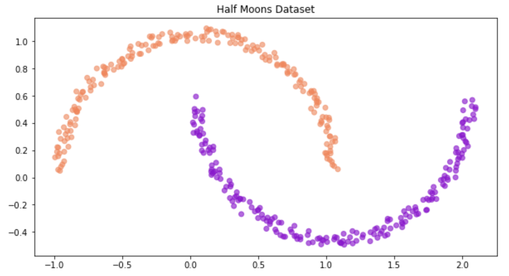
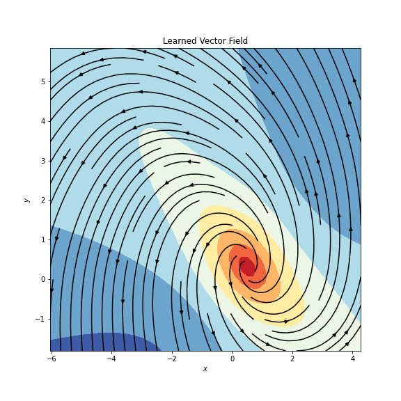
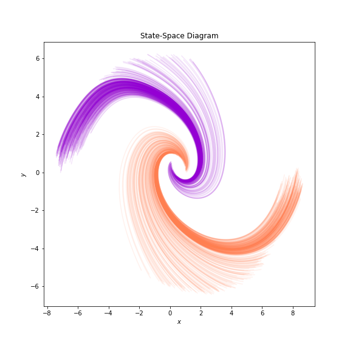
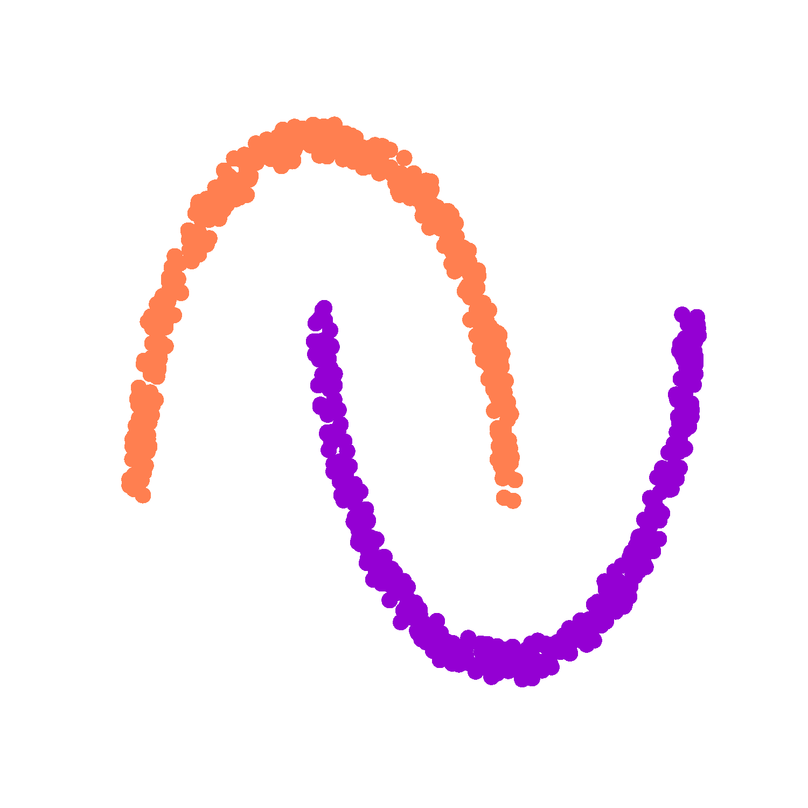
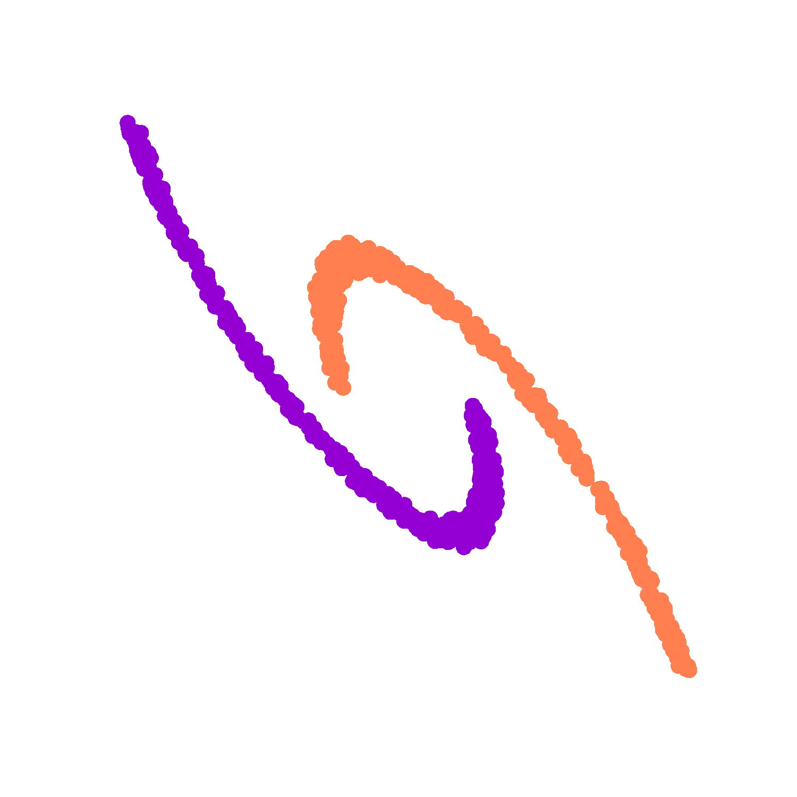

# NeuralODEs_practice

This repository is for study 'NeuralODEs' under the guidance of the [Professor Yong-ki, Ma](https://apmath.kongju.ac.kr/ZC0600/10503/subview.do) in [Kongju National University](https://english.kongju.ac.kr/eng/index.do).


### Dataset(Half moon dataset, 2-dimension)



### Problem definition

- Binary classification
    
### Trained results

- Vector-field



- State-space



- transformation sequence



- transformation sequence(Augmented NeuralODEs)




### Reference

````
@article{chen2018neuralode,
  title={Neural Ordinary Differential Equations},
  author={Chen, Ricky T. Q. and Rubanova, Yulia and Bettencourt, Jesse and Duvenaud, David},
  journal={Advances in Neural Information Processing Systems},
  year={2018}
}
```
```
@misc{torchdiffeq,
    author={Chen, Ricky T. Q.},
    title={torchdiffeq},
    year={2018},
    url={https://github.com/rtqichen/torchdiffeq},
}
```
```
@misc{lippe2022uvadlc,
   title        = {{UvA Deep Learning Tutorials}},
   author       = {Phillip Lippe},
   year         = 2022,
   howpublished = {\url{https://uvadlc-notebooks.readthedocs.io/en/latest/}}
}
```